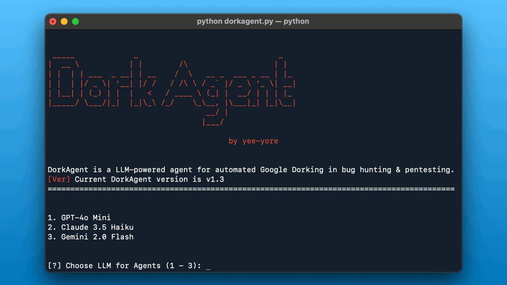

# DorkAgent
🤖 LLM-powered agent for automated Google Dorking in bug hunting &amp; pentesting.

                   
                                                                                                    
## Usage
1. Git clone
```bash
> git clone https://github.com/yee-yore/DorkAgent.git
```

2. Install packages
```bash
# python version = 3.11.9
> pip install -r requirements.txt
```

3. Configure API keys in the `.env` file  
- `SERPER_API_KEY` is **required**  
- You must set at least **one** LLM API key (e.g., OpenAI, Anthropic, or Gemini) depending on your preference  
- You can also integrate other LLMs: https://docs.crewai.com/concepts/llms
```bash
SERPER_API_KEY=        # Required - https://serper.dev/
OPENAI_API_KEY=        # Optional - set if using OpenAI
ANTHROPIC_API_KEY=     # Optional - set if using Anthropic
GEMINI_API_KEY=        # Optional - set if using Gemini (recommended)
```

4. Run `dorkagent.py`
```bash
> python dorkagent.py
```

For more description
https://medium.com/@yee-yore/llm-powered-agent-for-automated-google-dorking-dcb14d609dc2

## Customize
1. The number of google results (`serper_dev_tool.py` inside `site-packages/crewai_tools/tools/serper_dev_tool/`)
```bash
class SerperDevTool(BaseTool):
    ...
    args_schema: Type[BaseModel] = SerperDevToolSchema
    base_url: str = "https://google.serper.dev"
    n_results: int = 10 # min: 10, max: 100
    ...
```
2. Duration of google search results (`serper_dev_tool.py`)

```bash
# https://serper.dev/playground

def _make_api_request(self, search_query: str, search_type: str) -> dict:
    ...
    payload = json.dumps({"q": search_query, "num": self.n_results, "qdr:m"}) # Past week: "qdr:w", Past month: "qdr:m"
    ...
```
3. Google dorks (`task()`)
```bash
# Reference https://github.com/TakSec/google-dorks-bug-bounty
```
4. Agents (`agents()`)
```bash
# https://docs.crewai.com/concepts/agents
```

## TODO
- Support for Telegram bot
- Customizable Google Dorks set
- Task/Agent for Validation
- VPS mode


## Update Log
- **2025-04-01**: Added hybrid LLM option (GPT & Claude); Added dork `intitle:"IIS Windows Server"`; Applied prompt engineering to tasks.py; Added default depth consideration for subdomain inputs; Added `requirements.txt` for Windows/MacOS compatibility
- **2025-04-17**: Removed tasks(old).py, the version prior to prompt engineering; Deleted Google Dork for finding “Confidential” documents (most results were merely informative); Removed Google Dork targeting login panels; Added settings to help avoid LLM provider rate limits; Integrated Gemini Flash 2.0 (free to use and currently considered the best value LLM); Merged tasks.py and agents.py into dorkagent.py for simplified maintenance
- **2025-05-18**: Modified README.md and banner, Added juicy google dorks, Medium article (https://medium.com/@yee-yore/llm-powered-agent-for-automated-google-dorking-dcb14d609dc2)