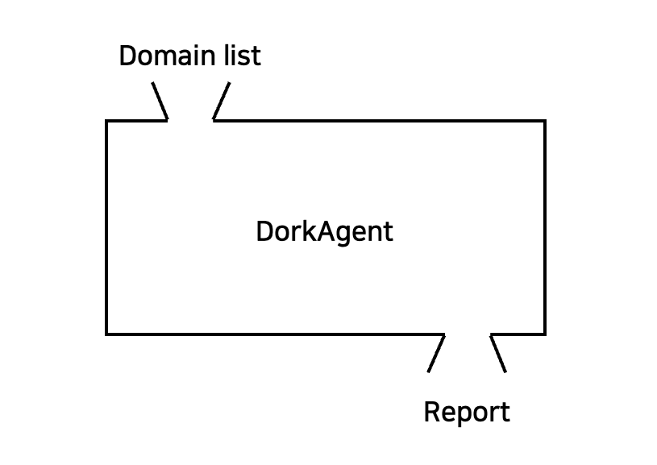

# DorkAgent
🤖 LLM-powered agent for automated Google Dorking in bug hunting &amp; pentesting.

                   
                                                                                                    
## Usage
1. Git clone
```bash
> git clone https://github.com/yee-yore/DorkAgent.git
```

2. Install packages
```bash
# python version = 3.11.9
> pip install -r requirements.txt # for macOS
> pip install -r requirements_windows.txt # for Windows
```

3. Config API keys in `.env` file 
Set either OpenAI or Anthropic API key. Also, you can add any types of LLM https://docs.crewai.com/concepts/llms
```bash
SERPER_API_KEY= # https://serper.dev/
OPENAI_API_KEY= 
ANTHROPIC_API_KEY=
```

4. Run `dorkagent.py`
```bash
> python dorkagent.py
```

## Customize
1. The number of google results (`serper_dev_tool.py` inside `site-packages/crewai_tools/tools/serper_dev_tool/`)
```bash
class SerperDevTool(BaseTool):
    ...
    args_schema: Type[BaseModel] = SerperDevToolSchema
    base_url: str = "https://google.serper.dev"
    n_results: int = 10 # min: 10, max: 100
    ...
```
2. Duration of googling (`serper_dev_tool.py`)

```bash
# https://serper.dev/playground

def _make_api_request(self, search_query: str, search_type: str) -> dict:
    ...
    payload = json.dumps({"q": search_query, "num": self.n_results, "qdr:m"}) # Past week: "qdr:w", Past month: "qdr:m"
    ...
```
3. Google dorks (`tasks.py`)
```bash
# Reference https://github.com/TakSec/google-dorks-bug-bounty
```
4. Agents (`agent.py`)
```bash
# https://docs.crewai.com/concepts/agents
```

## TODO
- Support for Telegram bot
- Logging Options

## Update Log
- **2025-04-01**: Added hybrid LLM option (GPT & Claude); Added dork `intitle:"IIS Windows Server"`; Applied prompt engineering to tasks.py; Added default depth consideration for subdomain inputs; Added `requirements.txt` for Windows/MacOS compatibility